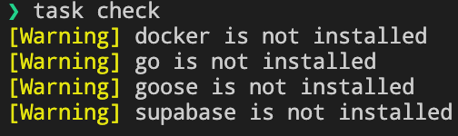

# topicpost-api

## 開発手順

- taskコマンドをインストールする
詳しい手順は以下のリンクを参照
[Installation - Taskfile.dev](https://taskfile.dev/installation/)

```sh
npm install -g task-cli
```

```sh
brew install go-task
```

必要なコマンドが入っているかの確認

```sh
task check
```

足りないコマンドがある場合は、以下の画像のように `[Warning] %s is not installed` と表示されます
不足がある場合はインストールをしてください



### ローカル環境の準備

- Dockerまたは、OrbStackのインストール

[Docker Desktop for Mac and Windows | Docker](https://www.docker.com/products/docker-desktop)
[OrbStack](https://orbstack.dev/)

- Supabase CLIのインストール

[Supabase CLI - Supabase.com](https://supabase.com/docs/guides/cli/getting-started)

Goのインストール

[Go - Getting Started](https://go.dev/doc/install)

gooseのインストール

[goose - GitHub](https://github.com/pressly/goose)

wireのインストール

[Wire - GitHub](https://github.com/google/wire)
